# Diagramme d'Activité - Projet COSONE

## Vue d'ensemble

Ce document présente les diagrammes d'activité du système COSONE, décrivant les flux de processus pour les principales fonctionnalités du système. Les diagrammes sont organisés par domaines fonctionnels pour une meilleure compréhension et une navigation facilitée.

## 1. Processus d'Authentification et Gestion des Utilisateurs

### 1.1 Processus d'Inscription des Utilisateurs Internes (Employés)

Le processus d'inscription des utilisateurs internes est divisé en trois sous-processus distincts pour une meilleure lisibilité :

#### 1.1.1 Première Connexion (Création du Compte)

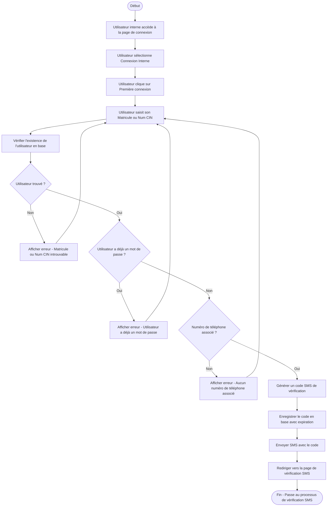

**Description :** Ce sous-processus gère la première connexion d'un employé interne. Il vérifie l'existence de l'utilisateur, s'assure qu'il n'a pas déjà de mot de passe, et initie le processus de vérification SMS.

#### 1.1.2 Vérification SMS et Création du Mot de Passe

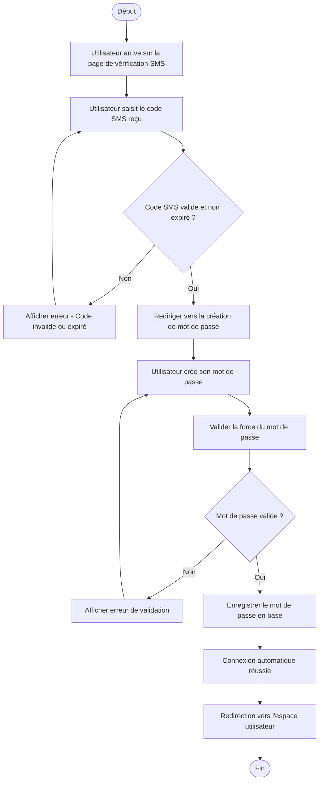

**Description :** Ce sous-processus gère la vérification SMS et la création du mot de passe. L'utilisateur doit saisir le code reçu par SMS, puis créer un mot de passe sécurisé pour finaliser son inscription.

#### 1.1.3 Connexion Régulière (Utilisateur Existant)

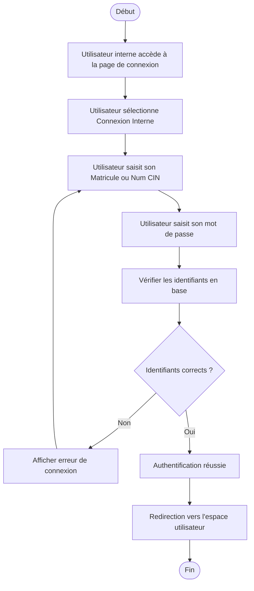

**Description :** Ce sous-processus gère la connexion régulière des utilisateurs internes qui ont déjà un compte et un mot de passe. Il vérifie simplement les identifiants et authentifie l'utilisateur.

**Flux Global :** Les trois sous-processus s'enchaînent selon le statut de l'utilisateur :
1. **Première connexion** → **Vérification SMS** → **Création mot de passe**
2. **Connexion régulière** (si l'utilisateur a déjà un compte)

### 1.2 Processus d'Inscription des Utilisateurs Externes (avec Code d'Authentification)

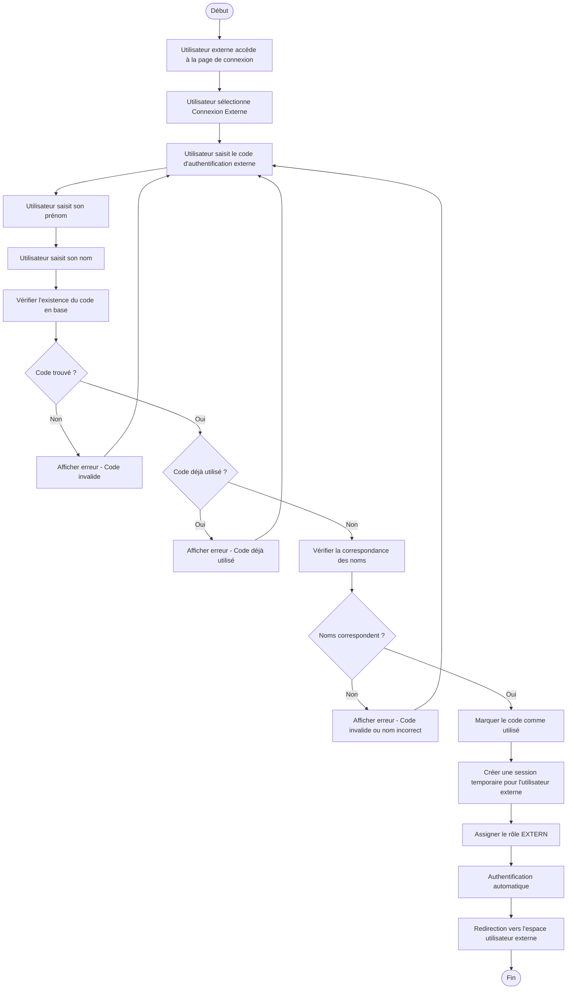

**Description :** Ce processus gère l'authentification des utilisateurs externes via des codes d'authentification à usage unique. L'utilisateur externe n'a pas besoin de mot de passe permanent, mais doit fournir un code valide et ses informations personnelles (prénom/nom) qui correspondent à celles associées au code. Le code devient inutilisable après utilisation.

### 1.3 Processus de Gestion des Codes d'Authentification Externes

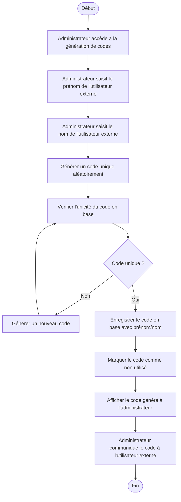

**Description :** Ce processus permet aux administrateurs de générer des codes d'authentification uniques pour les utilisateurs externes. Chaque code est associé à un prénom et nom spécifiques et ne peut être utilisé qu'une seule fois. L'administrateur doit communiquer le code et les informations associées à l'utilisateur externe.

### 1.4 Comparaison des Processus d'Authentification

| Aspect | Utilisateurs Internes | Utilisateurs Externes |
|--------|----------------------|----------------------|
| **Identification** | Matricule ou Num CIN | Code d'authentification externe |
| **Mot de passe** | Obligatoire (créé lors de la première connexion) | Non requis |
| **Vérification SMS** | Oui (pour première connexion) | Non |
| **Persistance** | Session permanente avec mot de passe | Session temporaire |
| **Rôle système** | USER/ADMIN | EXTERN |
| **Numéro téléphone** | Obligatoire | Non requis |
| **Réutilisation** | Connexions multiples | Code à usage unique |
| **Gestion** | Par l'employeur (base de données) | Par l'administrateur (codes générés) |

**Règles de validation spécifiques :**
- **Internes** : Matricule/Num CIN unique, numéro de téléphone obligatoire, mot de passe sécurisé
- **Externes** : Code unique, prénom/nom correspondants, code non utilisé

## 2. Processus de Réservation et Gestion des Séjours

### 2.1 Processus de Création de Réservation

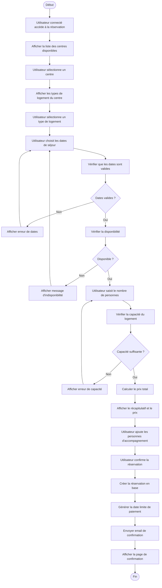

**Description :** Ce processus complet guide l'utilisateur depuis la sélection du centre jusqu'à la confirmation de sa réservation, en incluant toutes les validations nécessaires.

### 2.2 Processus de Vérification de Disponibilité

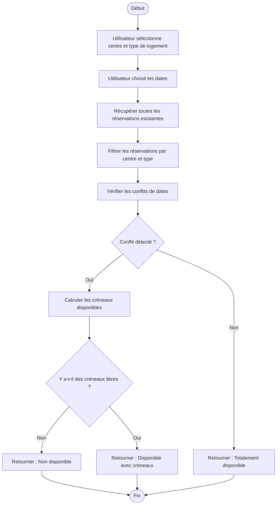

**Description :** Ce processus vérifie la disponibilité d'un logement pour des dates données, en tenant compte des réservations existantes et en calculant les créneaux libres.

### 2.3 Processus d'Annulation de Réservation

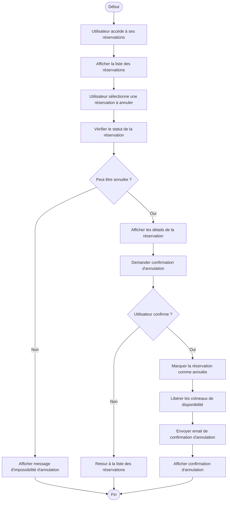

**Description :** Ce processus gère l'annulation des réservations en vérifiant les conditions d'annulation et en libérant les créneaux pour d'autres utilisateurs.

## 3. Processus de Paiement et Gestion Financière

### 3.1 Processus de Paiement

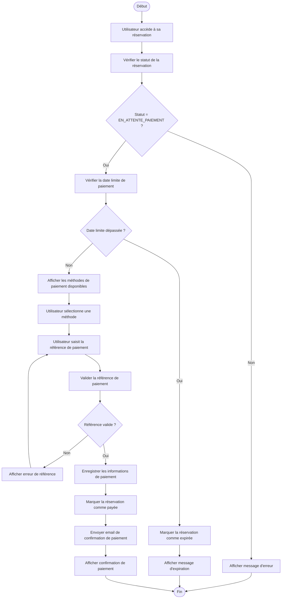

**Description :** Ce processus gère le paiement des réservations en vérifiant les conditions de paiement et en enregistrant les informations de transaction.

### 3.2 Processus de Calcul de Prix

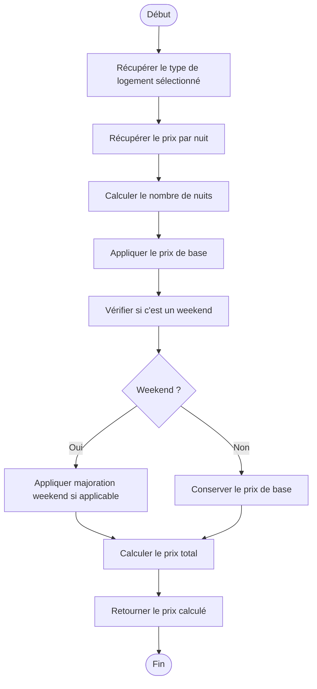

**Description :** Ce processus calcule le prix total d'une réservation en tenant compte du nombre de nuits, des majorations weekend et des tarifs spécifiques au type de logement.

## 4. Processus Système et Communications

### 4.1 Processus d'Envoi de SMS

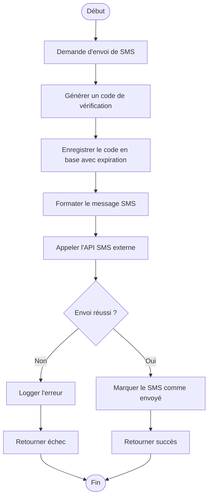

**Description :** Ce processus gère l'envoi de SMS de vérification avec génération de codes uniques et gestion des échecs d'envoi.

### 4.2 Processus de Validation et Contrôles Système

Ce processus regroupe les différents contrôles et validations effectués par le système :

**Validations Temporelles :**
- Réservations : Minimum 10 jours à l'avance
- Paiement : Maximum 24h après création
- Codes SMS : Expiration après 10 minutes

**Validations de Capacité :**
- Logements : Nombre de personnes ≤ capacité maximale
- Centres : Vérification de l'activité du centre

**Validations de Données :**
- Unicité : CIN, matricule, numéro de téléphone
- Format : Validation des formats de données
- Cohérence : Dates de début < dates de fin

**Description :** Ces processus de validation assurent l'intégrité des données et le respect des règles métier à chaque étape du système.

## 5. Points de Contrôle et Gestion des Erreurs

### 5.1 Stratégies de Validation

Le système implémente plusieurs niveaux de validation pour assurer la cohérence et la sécurité :

**Validation en Temps Réel :**
- Vérification immédiate des données saisies
- Feedback instantané à l'utilisateur
- Prévention des erreurs avant soumission

**Validation Métier :**
- Respect des règles de gestion spécifiques au domaine
- Contrôles de cohérence entre les différentes entités
- Validation des droits d'accès et permissions

### 5.2 Gestion des Erreurs et Exceptions

**Types d'Erreurs Gérées :**

1. **Erreurs de Validation** : Données incorrectes ou incomplètes
2. **Erreurs de Conflit** : Conflits de disponibilité ou d'unicité
3. **Erreurs Système** : Problèmes techniques (SMS, base de données)
4. **Erreurs de Sécurité** : Tentatives d'accès non autorisé

**Mécanismes de Gestion :**

- **Messages d'erreur clairs** : Information précise pour l'utilisateur
- **Rollback automatique** : Annulation des opérations en cas d'échec
- **Logs détaillés** : Traçabilité pour le débogage et l'audit
- **Récupération gracieuse** : Continuation du service malgré les erreurs

### 5.3 Monitoring et Traçabilité

**Points de Contrôle :**
- Enregistrement de toutes les actions utilisateur
- Suivi des performances des processus critiques
- Monitoring de la disponibilité des services externes
- Alertes automatiques en cas de problème

**Tableaux de Bord :**
- Statistiques d'utilisation en temps réel
- Métriques de performance des processus
- Indicateurs de qualité du service
- Rapports d'activité pour l'administration
