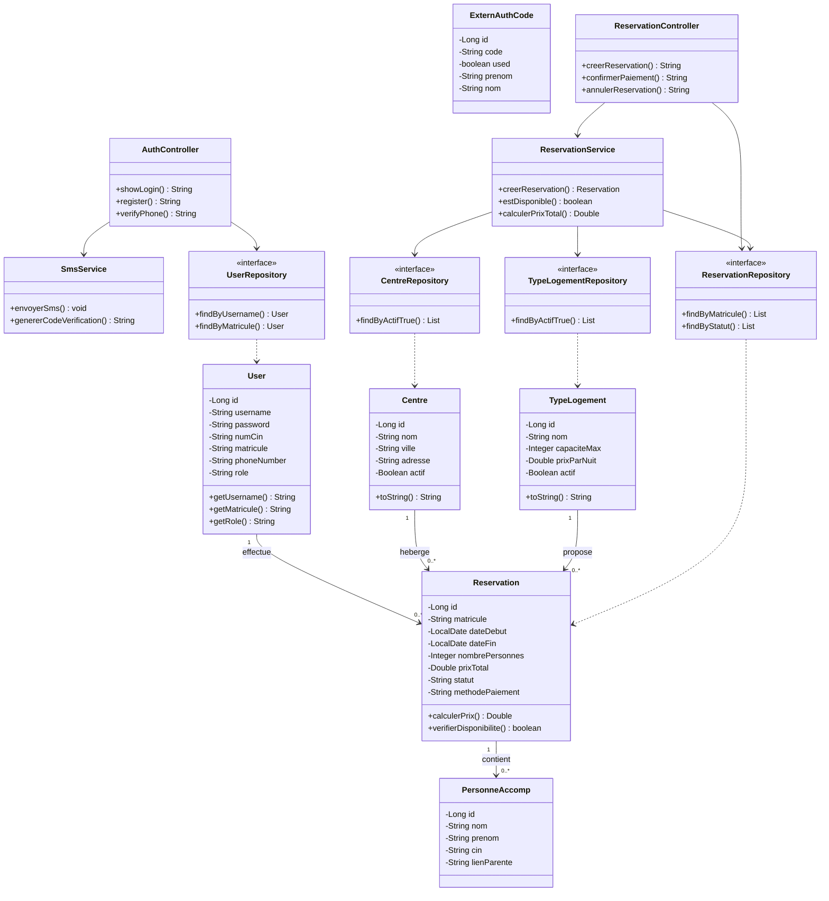

# Diagramme de Classes - Projet COSONE

## Vue d'ensemble

Ce diagramme présente l'architecture des classes du système COSONE, montrant les entités, contrôleurs, services et repositories avec leurs relations.

## Diagramme de Classes UML

## Description des Classes

### Entités (Domain Model)

1. **User** : Représente un utilisateur du système (employé, admin, externe)
   - Gère l'authentification et les rôles
   - Identifiants : username, matricule, CIN, téléphone

2. **Reservation** : Entité centrale pour les réservations
   - Contient les dates, nombre de personnes, prix
   - Statuts : EN_ATTENTE_PAIEMENT, PAYEE, ANNULEE, EXPIREE
   - Méthodes métier : calculerPrix(), verifierDisponibilite()

3. **Centre** : Centres de vacances disponibles
   - Informations de localisation (ville, adresse)
   - Statut actif/inactif pour gestion du catalogue

4. **TypeLogement** : Types d'hébergement (Studio, F2, Villa, etc.)
   - Capacité maximale et prix par nuit
   - Activation/désactivation flexible

5. **PersonneAccomp** : Accompagnants d'une réservation
   - Informations d'identité
   - Lien de parenté avec le réservant

6. **ExternAuthCode** : Codes d'authentification pour utilisateurs externes
   - Code unique à usage unique
   - Associé à un nom/prénom

### Contrôleurs (Presentation Layer)

- **AuthController** : Gestion de l'authentification (inscription, connexion, SMS)
- **ReservationController** : CRUD des réservations et paiements

### Services (Business Logic)

- **ReservationService** : Logique métier des réservations
  - Création et validation
  - Vérification de disponibilité
  - Calcul des prix
  
- **SmsService** : Gestion des SMS de vérification
  - Génération de codes
  - Envoi via API externe

### Repositories (Data Access)

Interfaces Spring Data JPA pour l'accès aux données :
- **UserRepository** : Recherche par username, matricule, CIN, téléphone
- **ReservationRepository** : Recherche par matricule, statut, dates
- **CentreRepository** : Centres actifs, filtrage par ville
- **TypeLogementRepository** : Types actifs, capacité

## Relations Principales

### Relations Entités
- **User → Reservation** (1:N) : Un utilisateur peut créer plusieurs réservations
- **Centre → Reservation** (1:N) : Un centre peut avoir plusieurs réservations
- **TypeLogement → Reservation** (1:N) : Un type peut être réservé plusieurs fois
- **Reservation → PersonneAccomp** (1:N) : Une réservation peut avoir plusieurs accompagnants

### Architecture en Couches
1. **Presentation** : Controllers gèrent les requêtes HTTP
2. **Business** : Services encapsulent la logique métier
3. **Data Access** : Repositories interfacent avec la base de données
4. **Domain** : Entités représentent le modèle de données

## Patterns Utilisés

- **MVC** : Séparation Modèle-Vue-Contrôleur
- **Repository** : Abstraction de l'accès aux données
- **Service Layer** : Encapsulation de la logique métier
- **Dependency Injection** : Injection des dépendances via Spring
- **DTO** : Transfer Objects pour les échanges de données

## Technologies

- **Spring Boot** : Framework principal
- **Spring Data JPA** : Persistence et repositories
- **Hibernate** : ORM pour mapping objet-relationnel
- **Spring Security** : Authentification et autorisation
- **Thymeleaf** : Moteur de templates côté serveur
