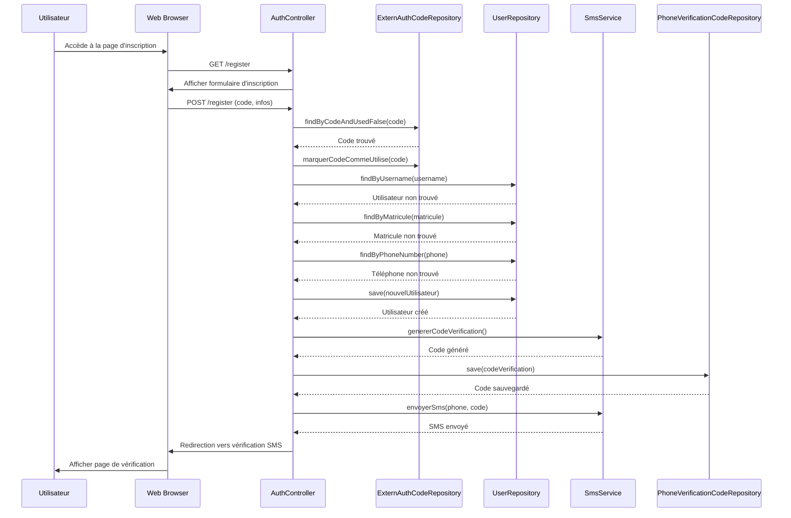
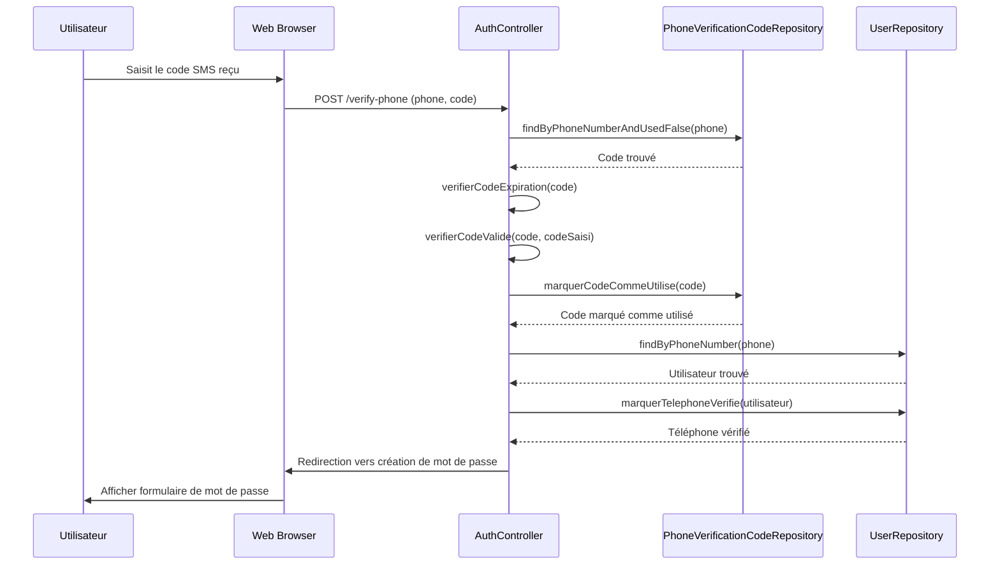
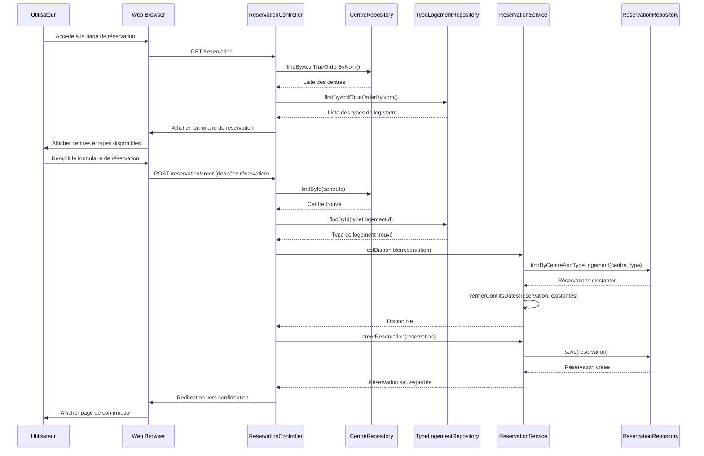
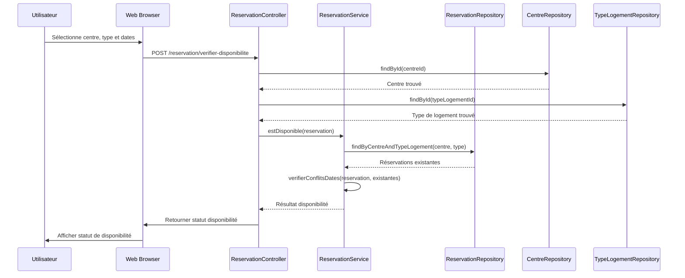
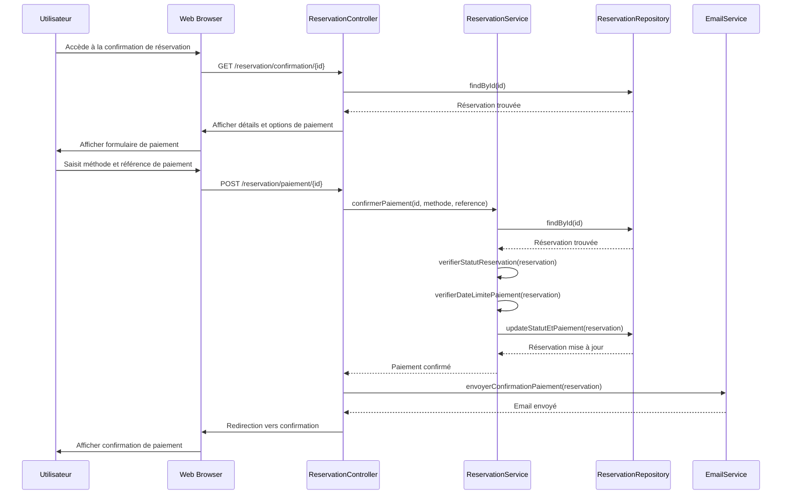
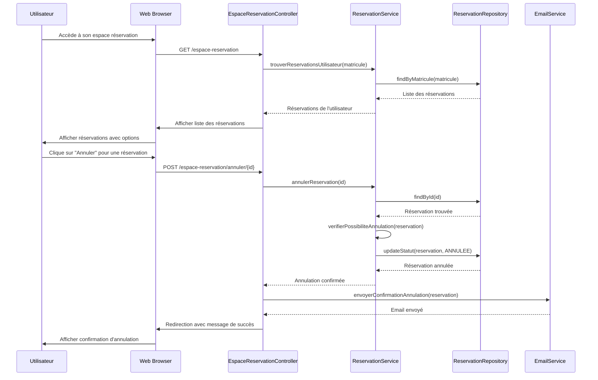
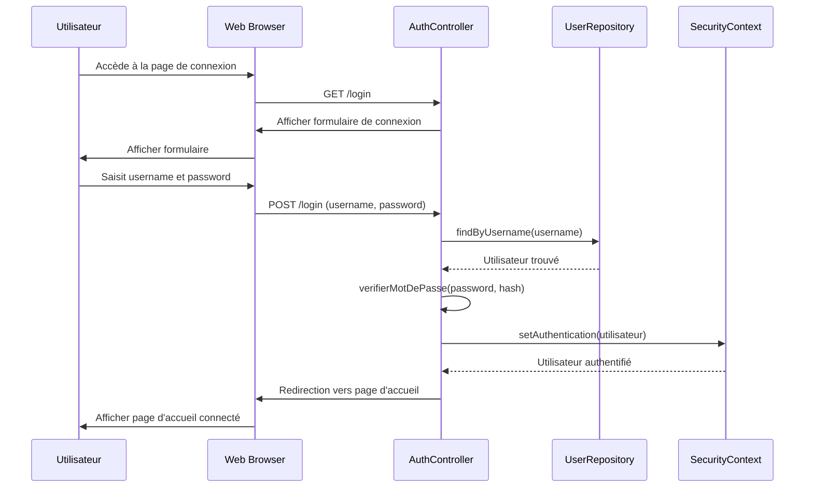
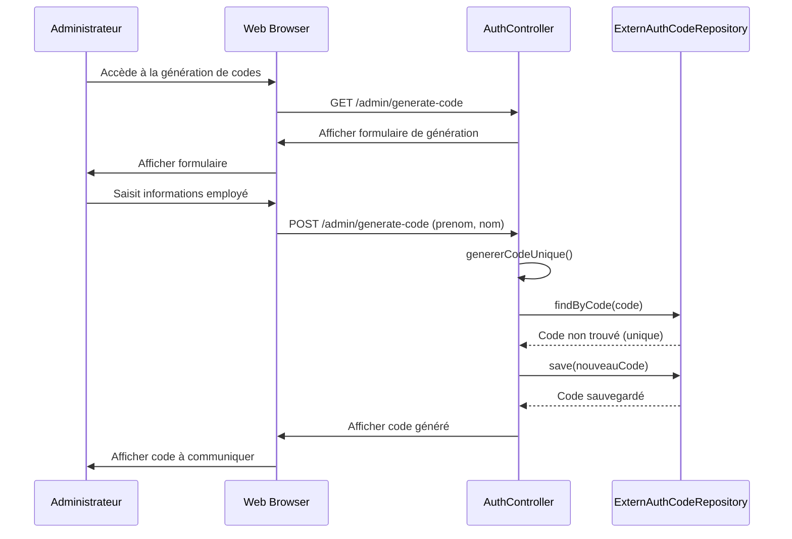
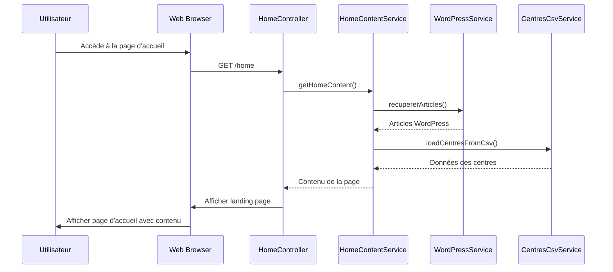
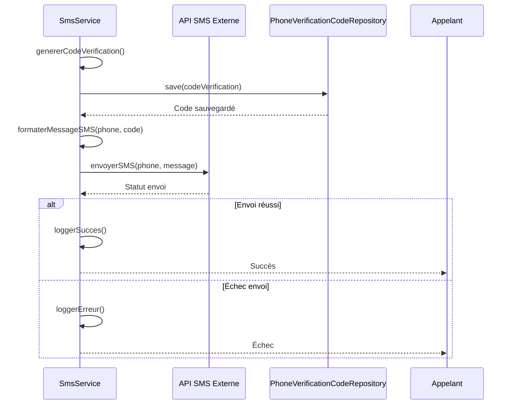

# Diagramme de Séquences - Projet COSONE

## Vue d'ensemble

Ce document présente les diagrammes de séquences du système COSONE, décrivant les interactions entre les différents composants pour les principales fonctionnalités.

## 1. Séquence d'Inscription Utilisateur

## 2. Séquence de Vérification SMS

## 3. Séquence de Création de Réservation

## 4. Séquence de Vérification de Disponibilité

## 5. Séquence de Confirmation de Paiement

## 6. Séquence d'Annulation de Réservation

## 7. Séquence de Connexion Utilisateur

## 8. Séquence de Génération de Code d'Authentification (Admin)

## 9. Séquence de Chargement de la Page d'Accueil

## 10. Séquence d'Envoi de SMS

## Points Clés des Interactions

### Gestion des Erreurs
- Chaque interaction inclut des vérifications de validité
- Les erreurs sont propagées avec des messages explicites
- Les rollbacks sont effectués en cas d'échec

### Sécurité
- Authentification requise pour les opérations sensibles
- Validation des données à chaque étape
- Gestion des sessions utilisateur

### Performance
- Utilisation de repositories pour l'accès aux données
- Mise en cache des données fréquemment utilisées
- Optimisation des requêtes de base de données

### Traçabilité
- Logging des opérations importantes
- Suivi des modifications d'état
- Historique des actions utilisateur
