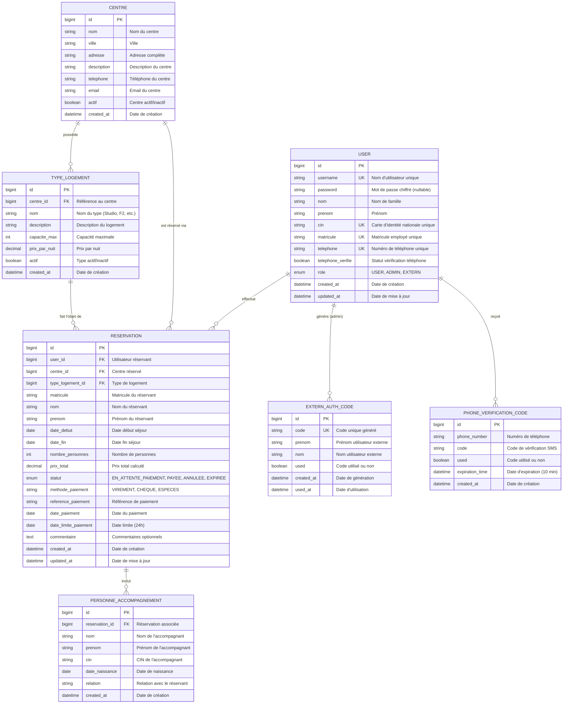

# Modèle Conceptuel de Données (MCD) - Système COSONE

## Vue d'ensemble

Ce document présente le Modèle Conceptuel de Données du système COSONE pour la gestion des réservations de centres de vacances.

## Diagramme Entité-Association (ERD)



## Description des Entités

### 1. USER (Utilisateur)
Représente tous les utilisateurs du système (employés, administrateurs, externes).

**Attributs clés :**
- `username` : Identifiant unique de connexion
- `password` : Nullable pour les utilisateurs externes
- `matricule` : Identifiant employé unique
- `role` : Définit les permissions (USER, ADMIN, EXTERN)

**Contraintes :**
- Unicité : username, CIN, matricule, téléphone
- `password` peut être NULL pour les utilisateurs externes

### 2. CENTRE (Centre de Vacances)
Représente les centres de vacances disponibles.

**Attributs clés :**
- `actif` : Permet d'activer/désactiver un centre sans le supprimer
- `ville` : Pour le filtrage géographique

**Règles :**
- Un centre peut avoir plusieurs types de logement
- Seuls les centres actifs apparaissent dans les recherches

### 3. TYPE_LOGEMENT (Type de Logement)
Représente les différents types d'hébergement (Studio, F2, Villa, etc.).

**Attributs clés :**
- `capacite_max` : Nombre maximum de personnes
- `prix_par_nuit` : Tarif de base
- `actif` : Activation/désactivation

**Règles :**
- Lié à un centre spécifique
- La capacité limite le nombre de personnes par réservation

### 4. RESERVATION (Réservation)
Entité centrale gérant le cycle de vie d'une réservation.

**Attributs clés :**
- `statut` : Suivi du processus (EN_ATTENTE_PAIEMENT, PAYEE, ANNULEE, EXPIREE)
- `date_limite_paiement` : 24h après création
- `prix_total` : Calculé automatiquement

**Règles métier :**
- `date_debut < date_fin`
- Paiement obligatoire dans les 24h
- Statut évolue selon le cycle de vie

### 5. PERSONNE_ACCOMPAGNEMENT (Accompagnant)
Personnes accompagnant le réservant principal.

**Attributs clés :**
- `relation` : Lien avec le réservant (conjoint, enfant, parent, ami)
- `cin` : Identification obligatoire

**Règles :**
- Nombre total (réservant + accompagnants) ≤ capacité du logement

### 6. EXTERN_AUTH_CODE (Code d'Authentification Externe)
Codes à usage unique pour les utilisateurs externes.

**Attributs clés :**
- `code` : Généré aléatoirement, unique
- `used` : Marque si le code a été utilisé
- `prenom`, `nom` : Doivent correspondre lors de l'utilisation

**Règles :**
- Utilisation unique
- Validation du nom/prénom obligatoire

### 7. PHONE_VERIFICATION_CODE (Code SMS)
Codes de vérification envoyés par SMS.

**Attributs clés :**
- `expiration_time` : Validité de 10 minutes
- `used` : Empêche la réutilisation

**Règles :**
- Expire après 10 minutes
- Usage unique

## Relations et Cardinalités

### USER → RESERVATION (1,N)
- Un utilisateur peut effectuer plusieurs réservations
- Une réservation appartient à un seul utilisateur

### CENTRE → TYPE_LOGEMENT (1,N)
- Un centre possède un ou plusieurs types de logement
- Un type de logement appartient à un seul centre

### CENTRE → RESERVATION (1,N)
- Un centre peut avoir plusieurs réservations
- Une réservation concerne un seul centre

### TYPE_LOGEMENT → RESERVATION (1,N)
- Un type de logement peut être réservé plusieurs fois (dates différentes)
- Une réservation concerne un seul type de logement

### RESERVATION → PERSONNE_ACCOMPAGNEMENT (1,N)
- Une réservation peut inclure zéro ou plusieurs accompagnants
- Un accompagnant appartient à une seule réservation

### USER → EXTERN_AUTH_CODE (1,N)
- Un administrateur peut générer plusieurs codes
- Un code est généré par un seul administrateur

### USER → PHONE_VERIFICATION_CODE (1,N)
- Un utilisateur peut recevoir plusieurs codes SMS (en cas d'expiration)
- Un code SMS est destiné à un seul utilisateur

## Contraintes d'Intégrité

### Contraintes d'Unicité
- `USER.username` : UNIQUE
- `USER.cin` : UNIQUE
- `USER.matricule` : UNIQUE
- `USER.telephone` : UNIQUE
- `EXTERN_AUTH_CODE.code` : UNIQUE

### Contraintes de Non-Nullité
- Tous les champs marqués comme clés étrangères (FK)
- Champs essentiels pour chaque entité

### Contraintes de Domaine
- `RESERVATION.date_debut < RESERVATION.date_fin`
- `RESERVATION.nombre_personnes <= TYPE_LOGEMENT.capacite_max`
- `RESERVATION.date_limite_paiement = RESERVATION.created_at + 24h`

### Contraintes Référentielles
- Cascade ON DELETE pour `PERSONNE_ACCOMPAGNEMENT` (si réservation supprimée)
- Restriction ON DELETE pour `TYPE_LOGEMENT` (si des réservations existent)
- Restriction ON DELETE pour `CENTRE` (si des types de logement existent)

## Index pour Performance

### Index Primaires
- Sur toutes les clés primaires (`id`)

### Index Secondaires
```sql
-- Pour les recherches d'utilisateur
INDEX idx_user_username ON USER(username)
INDEX idx_user_matricule ON USER(matricule)
INDEX idx_user_cin ON USER(cin)
INDEX idx_user_telephone ON USER(telephone)

-- Pour les recherches de réservation
INDEX idx_reservation_matricule ON RESERVATION(matricule)
INDEX idx_reservation_dates ON RESERVATION(date_debut, date_fin)
INDEX idx_reservation_statut ON RESERVATION(statut)
INDEX idx_reservation_centre ON RESERVATION(centre_id)

-- Pour la vérification de disponibilité
INDEX idx_reservation_centre_type ON RESERVATION(centre_id, type_logement_id)

-- Pour les codes
INDEX idx_extern_code ON EXTERN_AUTH_CODE(code)
INDEX idx_phone_verification ON PHONE_VERIFICATION_CODE(phone_number, expiration_time)
```

## Règles de Gestion Implémentées

1. **Authentification Double** : Utilisateurs internes (matricule + password) vs externes (code unique)
2. **Vérification SMS** : Obligatoire pour les nouveaux utilisateurs internes
3. **Disponibilité** : Pas de réservations conflictuelles pour un même centre/type/dates
4. **Capacité** : Respect strict de la capacité maximale
5. **Paiement** : Délai strict de 24h, sinon statut EXPIREE
6. **Activation/Désactivation** : Gestion du catalogue sans suppression physique
7. **Traçabilité** : Timestamps sur toutes les entités principales
8. **Sécurité** : Chiffrement des mots de passe, codes SMS expirables

## Évolution et Maintenance

Le schéma est géré automatiquement par **Hibernate/JPA** à partir des entités Java :
- Migrations automatiques en développement
- Migrations contrôlées en production
- Versioning via Git du code des entités

