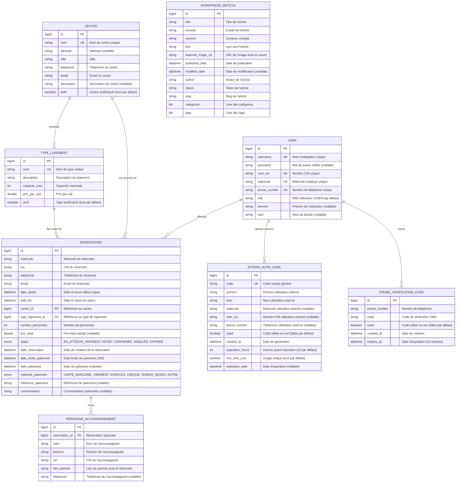

# Modèle Conceptuel de Données (MCD) - Système COSONE

## Vue d'ensemble

Ce document présente le Modèle Conceptuel de Données du système COSONE pour la gestion des réservations de centres de vacances.

## Diagramme Entité-Association (ERD)



## Description des Entités

### 1. USER (Utilisateur)
Représente tous les utilisateurs du système (employés, administrateurs, externes).

**Attributs clés :**
- `username` : Identifiant unique de connexion
- `password` : Nullable pour les utilisateurs externes
- `numCin` : Numéro CIN unique (anciennement `cin`)
- `matricule` : Identifiant employé unique
- `phoneNumber` : Numéro de téléphone unique (anciennement `telephone`)
- `role` : Définit les permissions (USER par défaut, ADMIN, EXTERN)
- `prenom` : Prénom de l'utilisateur (nullable, ajouté via migration)
- `nom` : Nom de famille de l'utilisateur (nullable, ajouté via migration)

**Contraintes :**
- Unicité : username, numCin, matricule, phoneNumber
- `password` peut être NULL pour les utilisateurs externes
- `prenom` et `nom` sont nullable pour permettre la création d'utilisateurs avec informations partielles

### 2. CENTRE (Centre de Vacances)
Représente les centres de vacances disponibles.

**Attributs clés :**
- `nom` : Nom unique du centre
- `actif` : Permet d'activer/désactiver un centre sans le supprimer (true par défaut)
- `ville` : Pour le filtrage géographique
- `adresse` : Adresse complète du centre
- `telephone` et `email` : Coordonnées de contact
- `description` : Description détaillée (nullable)

**Règles :**
- Le nom du centre doit être unique
- Un centre peut avoir plusieurs types de logement
- Seuls les centres actifs apparaissent dans les recherches

### 3. TYPE_LOGEMENT (Type de Logement)
Représente les différents types d'hébergement (Studio, F2, Villa, etc.).

**Attributs clés :**
- `nom` : Nom unique du type de logement
- `capaciteMax` : Nombre maximum de personnes
- `prixParNuit` : Tarif de base (type Double)
- `actif` : Activation/désactivation (true par défaut)
- `description` : Description détaillée du logement

**Règles :**
- Le nom du type de logement doit être unique
- La capacité limite le nombre de personnes par réservation
- Seuls les types actifs apparaissent dans les recherches

### 4. RESERVATION (Réservation)
Entité centrale gérant le cycle de vie d'une réservation.

**Attributs clés :**
- `matricule`, `cin`, `telephone`, `email` : Informations du réservant
- `dateDebut`, `dateFin` : Dates et heures de séjour (type LocalDateTime)
- `statut` : Suivi du processus (EN_ATTENTE_PAIEMENT, PAYEE, CONFIRMEE, ANNULEE, EXPIREE)
- `dateReservation` : Date de création (automatique)
- `dateLimitePaiement` : 24h après création (automatique)
- `datePaiement` : Date effective du paiement (nullable)
- `methodePaiement` : Enum (CARTE_BANCAIRE, VIREMENT, ESPECES, CHEQUE, MOBILE_MONEY, AUTRE)
- `referencePaiement` : Référence de paiement (nullable)
- `prixTotal` : Prix total calculé (nullable)
- `commentaires` : Commentaires optionnels (nullable)

**Règles métier :**
- `dateDebut < dateFin`
- Paiement obligatoire dans les 24h
- Statut évolue selon le cycle de vie
- Nombre de personnes ≤ capacité du type de logement

### 5. PERSONNE_ACCOMPAGNEMENT (Accompagnant)
Personnes accompagnant le réservant principal.

**Attributs clés :**
- `nom`, `prenom` : Nom complet de l'accompagnant
- `cin` : Identification obligatoire
- `lienParente` : Lien avec le réservant (conjoint, enfant, parent, ami)
- `telephone` : Téléphone de l'accompagnant (nullable)

**Règles :**
- Nombre total (réservant + accompagnants) ≤ capacité du logement
- Chaque accompagnant doit avoir un CIN valide

### 6. EXTERN_AUTH_CODE (Code d'Authentification Externe)
Codes à usage unique pour les utilisateurs externes.

**Attributs clés :**
- `code` : Généré aléatoirement, unique
- `prenom`, `nom` : Doivent correspondre lors de l'utilisation
- `matricule`, `numCin`, `phoneNumber` : Informations supplémentaires (nullable)
- `used` : Marque si le code a été utilisé (false par défaut)
- `createdAt` : Date de génération (automatique)
- `expirationHours` : Heures avant expiration (24 par défaut)
- `oneTimeOnly` : Usage unique (true par défaut)
- `expirationDate` : Date d'expiration calculée (nullable)

**Règles :**
- Utilisation unique si `oneTimeOnly` est true
- Validation du nom/prénom obligatoire
- Expiration après le nombre d'heures défini

### 7. PHONE_VERIFICATION_CODE (Code SMS)
Codes de vérification envoyés par SMS.

**Attributs clés :**
- `phoneNumber` : Numéro de téléphone destinataire
- `code` : Code de vérification généré
- `used` : Empêche la réutilisation (false par défaut)
- `createdAt` : Date de création (automatique)
- `expiresAt` : Date d'expiration (10 minutes par défaut)

**Règles :**
- Expire après 10 minutes
- Usage unique
- Code généré automatiquement

### 8. WORDPRESS_ARTICLE (Article WordPress)
Entité pour l'intégration avec le système de gestion de contenu WordPress.

**Attributs clés :**
- `title` : Titre de l'article
- `excerpt` : Extrait de l'article
- `content` : Contenu complet
- `link` : Lien vers l'article original
- `featuredImageUrl` : URL de l'image mise en avant
- `publishedDate` : Date de publication
- `modifiedDate` : Date de modification (nullable)
- `author` : Auteur de l'article
- `status` : Statut de l'article
- `slug` : Slug de l'article
- `categories` : Liste des catégories
- `tags` : Liste des tags

**Règles :**
- Entité non persistée (utilisée pour l'intégration API)
- Synchronisation avec le CMS WordPress externe

## Relations et Cardinalités

### USER → RESERVATION (1,N)
- Un utilisateur peut effectuer plusieurs réservations
- Une réservation appartient à un seul utilisateur

### CENTRE → TYPE_LOGEMENT (1,N)
- Un centre possède un ou plusieurs types de logement
- Un type de logement appartient à un seul centre

### CENTRE → RESERVATION (1,N)
- Un centre peut avoir plusieurs réservations
- Une réservation concerne un seul centre

### TYPE_LOGEMENT → RESERVATION (1,N)
- Un type de logement peut être réservé plusieurs fois (dates différentes)
- Une réservation concerne un seul type de logement

### RESERVATION → PERSONNE_ACCOMPAGNEMENT (1,N)
- Une réservation peut inclure zéro ou plusieurs accompagnants
- Un accompagnant appartient à une seule réservation

### USER → EXTERN_AUTH_CODE (1,N)
- Un administrateur peut générer plusieurs codes
- Un code est généré par un seul administrateur

### USER → PHONE_VERIFICATION_CODE (1,N)
- Un utilisateur peut recevoir plusieurs codes SMS (en cas d'expiration)
- Un code SMS est destiné à un seul utilisateur

## Contraintes d'Intégrité

### Contraintes d'Unicité
- `USER.username` : UNIQUE
- `USER.num_cin` : UNIQUE (anciennement `cin`)
- `USER.matricule` : UNIQUE
- `USER.phone_number` : UNIQUE (anciennement `telephone`)
- `CENTRE.nom` : UNIQUE
- `TYPE_LOGEMENT.nom` : UNIQUE
- `EXTERN_AUTH_CODE.code` : UNIQUE

### Contraintes de Non-Nullité
- Tous les champs marqués comme clés étrangères (FK)
- Champs essentiels pour chaque entité
- `USER.role` : NOT NULL (défaut "USER")
- `CENTRE.actif` : NOT NULL (défaut true)
- `TYPE_LOGEMENT.actif` : NOT NULL (défaut true)

### Contraintes de Domaine
- `RESERVATION.date_debut < RESERVATION.date_fin`
- `RESERVATION.nombre_personnes <= TYPE_LOGEMENT.capacite_max`
- `RESERVATION.date_limite_paiement = RESERVATION.date_reservation + 24h`
- `PHONE_VERIFICATION_CODE.expires_at = PHONE_VERIFICATION_CODE.created_at + 10 minutes`
- `EXTERN_AUTH_CODE.expiration_date = EXTERN_AUTH_CODE.created_at + expiration_hours`

### Contraintes Référentielles
- Cascade ON DELETE pour `PERSONNE_ACCOMPAGNEMENT` (si réservation supprimée)
- Restriction ON DELETE pour `TYPE_LOGEMENT` (si des réservations existent)
- Restriction ON DELETE pour `CENTRE` (si des types de logement existent)

### Contraintes de Valeurs Par Défaut
- `USER.password` : NULL (pour utilisateurs externes)
- `USER.role` : "USER"
- `CENTRE.actif` : true
- `TYPE_LOGEMENT.actif` : true
- `EXTERN_AUTH_CODE.used` : false
- `EXTERN_AUTH_CODE.expiration_hours` : 24
- `EXTERN_AUTH_CODE.one_time_only` : true
- `PHONE_VERIFICATION_CODE.used` : false

## Index pour Performance

### Index Primaires
- Sur toutes les clés primaires (`id`)

### Index Secondaires
```sql
-- Pour les recherches d'utilisateur
INDEX idx_user_username ON users(username)
INDEX idx_user_matricule ON users(matricule)
INDEX idx_user_num_cin ON users(num_cin)
INDEX idx_user_phone_number ON users(phone_number)

-- Pour les recherches de réservation
INDEX idx_reservation_matricule ON reservations(matricule)
INDEX idx_reservation_dates ON reservations(date_debut, date_fin)
INDEX idx_reservation_statut ON reservations(statut)
INDEX idx_reservation_centre ON reservations(centre_id)
INDEX idx_reservation_type_logement ON reservations(type_logement_id)

-- Pour la vérification de disponibilité
INDEX idx_reservation_centre_type ON reservations(centre_id, type_logement_id)

-- Pour les codes d'authentification externe
INDEX idx_extern_auth_codes_code ON extern_auth_codes(code)
INDEX idx_extern_auth_codes_expiration ON extern_auth_codes(expiration_date)
INDEX idx_extern_auth_codes_used ON extern_auth_codes(used)

-- Pour les codes de vérification SMS
INDEX idx_phone_verification ON phone_verification_codes(phone_number, expires_at)
INDEX idx_phone_verification_used ON phone_verification_codes(used)

-- Pour les centres et types de logement
INDEX idx_centres_actif ON centres(actif)
INDEX idx_types_logement_actif ON types_logement(actif)
```

## Règles de Gestion Implémentées

1. **Authentification Double** : Utilisateurs internes (matricule + password) vs externes (code unique)
2. **Vérification SMS** : Obligatoire pour les nouveaux utilisateurs internes (expiration 10 minutes)
3. **Disponibilité** : Pas de réservations conflictuelles pour un même centre/type/dates
4. **Capacité** : Respect strict de la capacité maximale du type de logement
5. **Paiement** : Délai strict de 24h, sinon statut EXPIREE automatiquement
6. **Activation/Désactivation** : Gestion du catalogue sans suppression physique (champ `actif`)
7. **Traçabilité** : Timestamps automatiques sur toutes les entités principales
8. **Sécurité** : Chiffrement des mots de passe, codes SMS expirables
9. **Codes Externes** : Expiration configurable (24h par défaut), usage unique
10. **Validation** : Contrôles d'intégrité au niveau base de données et applicatif
11. **Méthodes de Paiement** : Support étendu (CARTE_BANCAIRE, VIREMENT, ESPECES, CHEQUE, MOBILE_MONEY, AUTRE)
12. **Statuts de Réservation** : Cycle complet (EN_ATTENTE_PAIEMENT → PAYEE → CONFIRMEE ou ANNULEE/EXPIREE)

## Évolution et Maintenance

Le schéma est géré automatiquement par **Hibernate/JPA** à partir des entités Java :
- Migrations automatiques en développement
- Migrations contrôlées en production via scripts SQL
- Versioning via Git du code des entités

### Migrations Récentes
- **Ajout de colonnes USER** : `prenom` et `nom` (nullable)
- **Extension EXTERN_AUTH_CODE** : Ajout de `matricule`, `num_cin`, `phone_number`, `expiration_hours`, `one_time_only`, `expiration_date`
- **Mise à jour contraintes** : `password` nullable pour utilisateurs externes
- **Nouveaux index** : Optimisation des performances pour les codes d'authentification

### Évolutions Futures
- Intégration avec systèmes de paiement externes
- Support des notifications push
- Extension des méthodes d'authentification
- Audit trail complet des modifications

