# Diagramme de Cas d'Utilisation - Projet COSONE

## Vue d'ensemble

Ce diagramme présente les cas d'utilisation du système COSONE, montrant les interactions entre les acteurs et le système pour la gestion des réservations de centres de vacances.

## Diagramme de Cas d'Utilisation

```mermaid
graph TB
    %% Acteurs
    Utilisateur[👤 Utilisateur<br/>Employé]
    Administrateur[👨‍💼 Administrateur<br/>Système]
    Systeme[🔧 Système<br/>Externe]
    WordPress[📝 WordPress<br/>CMS]
    
    %% Cas d'utilisation - Authentification
    subgraph Auth["🔐 Authentification"]
        UC1[Inscription avec code externe]
        UC2[Vérification par SMS]
        UC3[Connexion]
        UC4[Création de mot de passe]
        UC5[Déconnexion]
    end
    
    %% Cas d'utilisation - Gestion des réservations
    subgraph Reservation["🏨 Gestion des Réservations"]
        UC6[Consulter les centres disponibles]
        UC7[Consulter les types de logement]
        UC8[Vérifier la disponibilité]
        UC9[Créer une réservation]
        UC10[Calculer le prix]
        UC11[Consulter ses réservations]
        UC12[Annuler une réservation]
        UC13[Confirmer le paiement]
        UC14[Consulter les détails d'une réservation]
    end
    
    %% Cas d'utilisation - Gestion des accompagnants
    subgraph Accompagnants["👥 Gestion des Accompagnants"]
        UC15[Ajouter une personne d'accompagnement]
        UC16[Modifier les informations d'accompagnement]
        UC17[Supprimer une personne d'accompagnement]
    end
    
    %% Cas d'utilisation - Administration
    subgraph Admin["⚙️ Administration"]
        UC18[Gérer les utilisateurs]
        UC19[Générer des codes d'authentification]
        UC20[Gérer les centres]
        UC21[Gérer les types de logement]
        UC22[Consulter les statistiques]
        UC23[Exporter les données]
    end
    
    %% Cas d'utilisation - Contenu
    subgraph Contenu["📄 Gestion du Contenu"]
        UC24[Consulter la page d'accueil]
        UC25[Consulter les articles WordPress]
        UC26[Consulter les informations des centres]
    end
    
    %% Cas d'utilisation - Notifications
    subgraph Notifications["📧 Notifications"]
        UC27[Recevoir des emails de confirmation]
        UC28[Recevoir des SMS de vérification]
        UC29[Recevoir des rappels de paiement]
    end
    
    %% Relations Utilisateur
    Utilisateur --> UC1
    Utilisateur --> UC2
    Utilisateur --> UC3
    Utilisateur --> UC4
    Utilisateur --> UC5
    Utilisateur --> UC6
    Utilisateur --> UC7
    Utilisateur --> UC8
    Utilisateur --> UC9
    Utilisateur --> UC10
    Utilisateur --> UC11
    Utilisateur --> UC12
    Utilisateur --> UC13
    Utilisateur --> UC14
    Utilisateur --> UC15
    Utilisateur --> UC16
    Utilisateur --> UC17
    Utilisateur --> UC24
    Utilisateur --> UC25
    Utilisateur --> UC26
    Utilisateur --> UC27
    Utilisateur --> UC28
    Utilisateur --> UC29
    
    %% Relations Administrateur
    Administrateur --> UC3
    Administrateur --> UC5
    Administrateur --> UC18
    Administrateur --> UC19
    Administrateur --> UC20
    Administrateur --> UC21
    Administrateur --> UC22
    Administrateur --> UC23
    Administrateur --> UC24
    Administrateur --> UC25
    Administrateur --> UC26
    
    %% Relations Système
    Systeme --> UC27
    Systeme --> UC28
    Systeme --> UC29
    
    %% Relations WordPress
    WordPress --> UC25
    
    %% Relations d'inclusion
    UC9 -.->|inclut| UC8
    UC9 -.->|inclut| UC10
    UC9 -.->|inclut| UC15
    UC13 -.->|inclut| UC10
    
    %% Relations d'extension
    UC2 -.->|étend| UC1
    UC4 -.->|étend| UC2
    UC12 -.->|étend| UC11
    UC14 -.->|étend| UC11
```

## Description Détaillée des Cas d'Utilisation

### 1. Authentification

#### UC1 - Inscription avec code externe
- **Acteur principal** : Utilisateur
- **Préconditions** : Avoir un code d'authentification valide
- **Scénario principal** :
  1. L'utilisateur saisit son code d'authentification
  2. Le système vérifie la validité du code
  3. L'utilisateur saisit ses informations personnelles
  4. Le système crée le compte utilisateur
  5. Le système envoie un SMS de vérification

#### UC2 - Vérification par SMS
- **Acteur principal** : Utilisateur
- **Préconditions** : Avoir reçu un SMS de vérification
- **Scénario principal** :
  1. L'utilisateur reçoit un SMS avec un code
  2. L'utilisateur saisit le code reçu
  3. Le système vérifie le code
  4. Le système valide le numéro de téléphone

#### UC3 - Connexion
- **Acteur principal** : Utilisateur, Administrateur
- **Préconditions** : Avoir un compte valide
- **Scénario principal** :
  1. L'utilisateur saisit ses identifiants
  2. Le système vérifie les informations
  3. Le système authentifie l'utilisateur
  4. L'utilisateur accède à son espace

### 2. Gestion des Réservations

#### UC6 - Consulter les centres disponibles
- **Acteur principal** : Utilisateur
- **Scénario principal** :
  1. L'utilisateur accède à la page des centres
  2. Le système affiche la liste des centres actifs
  3. L'utilisateur peut filtrer par ville ou critères

#### UC9 - Créer une réservation
- **Acteur principal** : Utilisateur
- **Préconditions** : Être connecté
- **Scénario principal** :
  1. L'utilisateur sélectionne un centre et un type de logement
  2. L'utilisateur choisit les dates de séjour
  3. Le système vérifie la disponibilité
  4. L'utilisateur saisit le nombre de personnes
  5. L'utilisateur ajoute les personnes d'accompagnement
  6. Le système calcule le prix total
  7. L'utilisateur confirme la réservation
  8. Le système crée la réservation avec statut "EN_ATTENTE_PAIEMENT"

#### UC13 - Confirmer le paiement
- **Acteur principal** : Utilisateur
- **Préconditions** : Avoir une réservation en attente de paiement
- **Scénario principal** :
  1. L'utilisateur accède à sa réservation
  2. L'utilisateur sélectionne la méthode de paiement
  3. L'utilisateur saisit la référence de paiement
  4. Le système met à jour le statut de la réservation
  5. Le système envoie une confirmation par email

### 3. Administration

#### UC18 - Gérer les utilisateurs
- **Acteur principal** : Administrateur
- **Scénario principal** :
  1. L'administrateur accède à la liste des utilisateurs
  2. L'administrateur peut consulter les informations
  3. L'administrateur peut modifier les rôles
  4. L'administrateur peut désactiver des comptes

#### UC19 - Générer des codes d'authentification
- **Acteur principal** : Administrateur
- **Scénario principal** :
  1. L'administrateur accède à la génération de codes
  2. L'administrateur saisit les informations de l'employé
  3. Le système génère un code unique
  4. Le système sauvegarde le code en base

### 4. Gestion du Contenu

#### UC24 - Consulter la page d'accueil
- **Acteur principal** : Utilisateur, Administrateur
- **Scénario principal** :
  1. L'utilisateur accède à la page d'accueil
  2. Le système récupère le contenu depuis WordPress
  3. Le système affiche les articles et informations
  4. L'utilisateur peut naviguer vers les fonctionnalités

## Relations entre Cas d'Utilisation

### Relations d'Inclusion
- **UC9 inclut UC8** : Créer une réservation inclut la vérification de disponibilité
- **UC9 inclut UC10** : Créer une réservation inclut le calcul du prix
- **UC9 inclut UC15** : Créer une réservation inclut l'ajout d'accompagnants
- **UC13 inclut UC10** : Confirmer le paiement inclut le calcul du prix

### Relations d'Extension
- **UC2 étend UC1** : La vérification SMS étend l'inscription
- **UC4 étend UC2** : La création de mot de passe étend la vérification SMS
- **UC12 étend UC11** : Annuler une réservation étend la consultation des réservations
- **UC14 étend UC11** : Consulter les détails étend la consultation des réservations

## Acteurs du Système

### 1. Utilisateur (Employé)
- **Description** : Employé de l'entreprise utilisant le système pour réserver des centres de vacances
- **Responsabilités** : S'inscrire, se connecter, créer des réservations, gérer ses accompagnants

### 2. Administrateur
- **Description** : Personne responsable de la gestion du système et des utilisateurs
- **Responsabilités** : Gérer les utilisateurs, générer des codes, administrer les centres

### 3. Système Externe
- **Description** : Services externes pour l'envoi d'emails et SMS
- **Responsabilités** : Envoyer des notifications automatiques

### 4. WordPress CMS
- **Description** : Système de gestion de contenu pour les articles et informations
- **Responsabilités** : Fournir du contenu dynamique à la page d'accueil

## Contraintes et Règles Métier

1. **Authentification** : Un code d'authentification ne peut être utilisé qu'une seule fois
2. **Réservations** : Les réservations doivent être effectuées au moins 10 jours à l'avance
3. **Paiement** : Le paiement doit être effectué dans les 24h suivant la création de la réservation
4. **Accompagnants** : Le nombre total de personnes ne peut dépasser la capacité du logement
5. **Disponibilité** : Vérification automatique des conflits de dates
