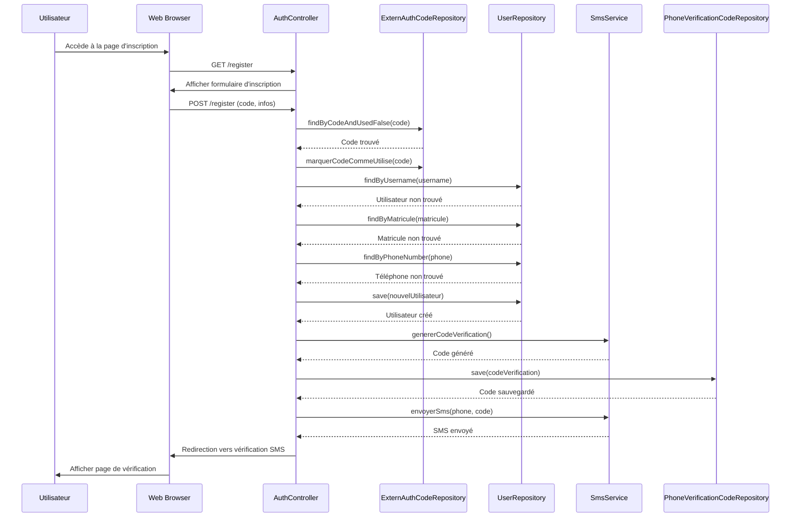
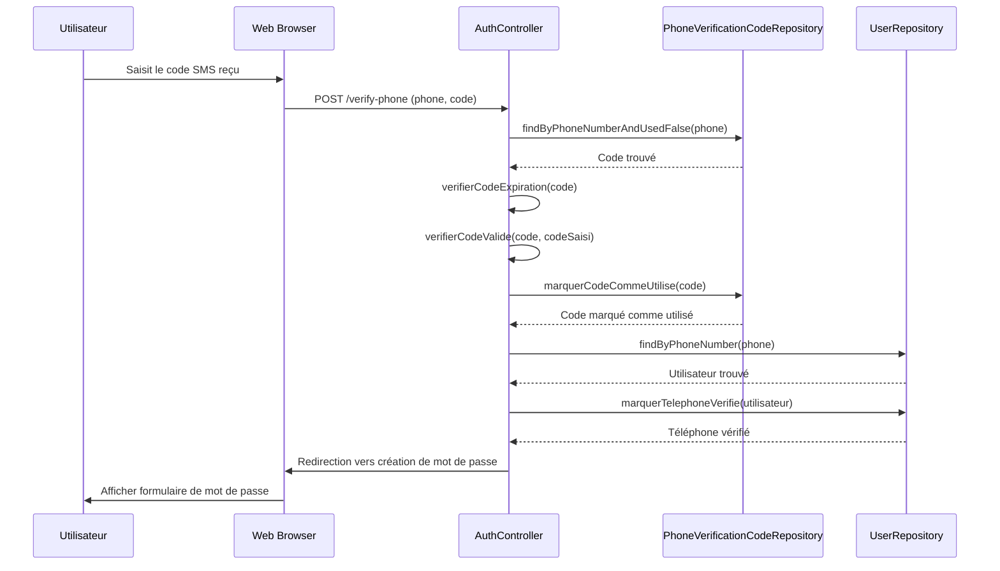
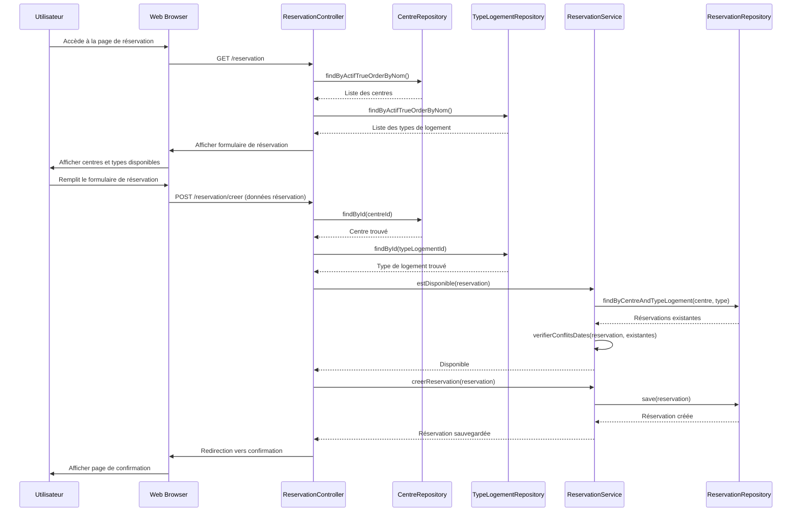
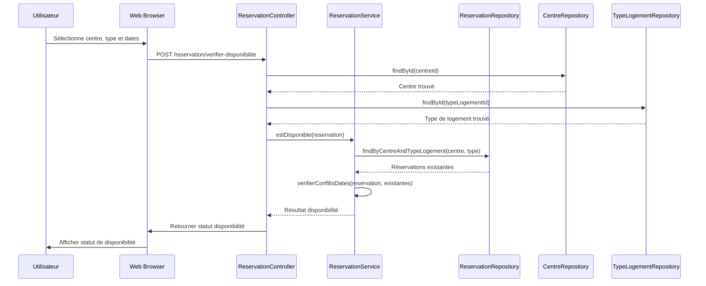
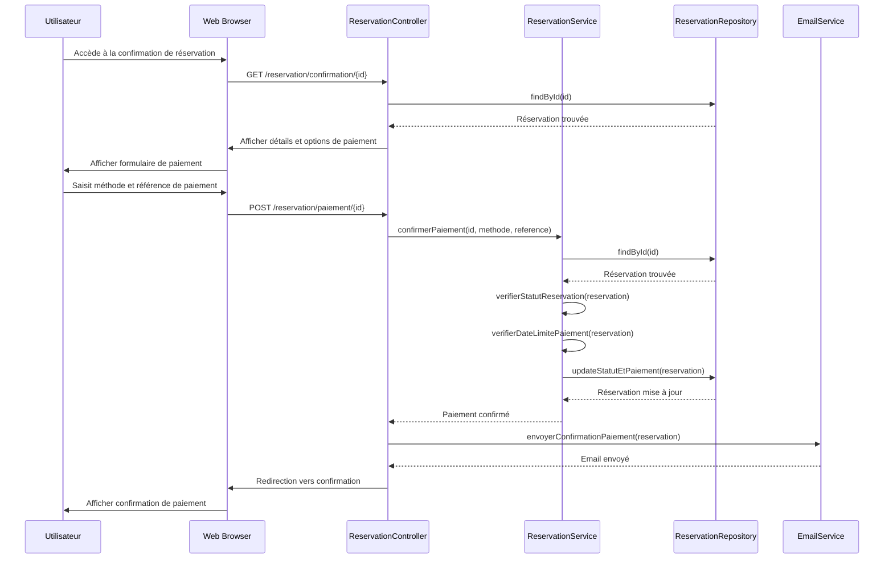
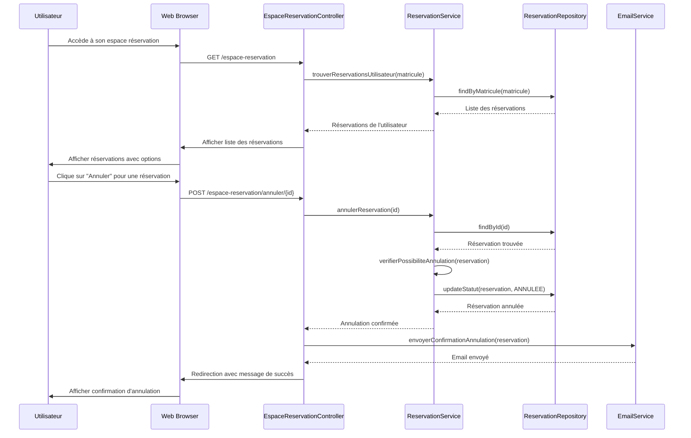
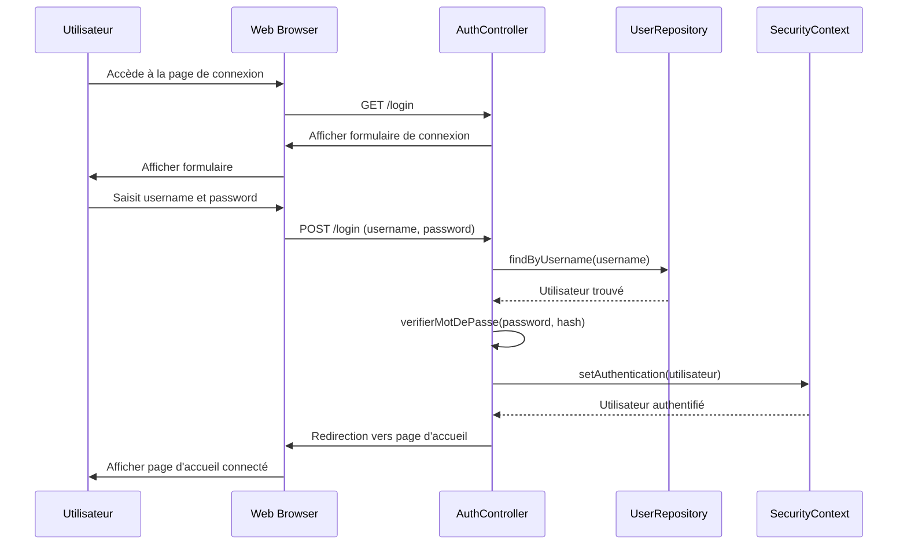
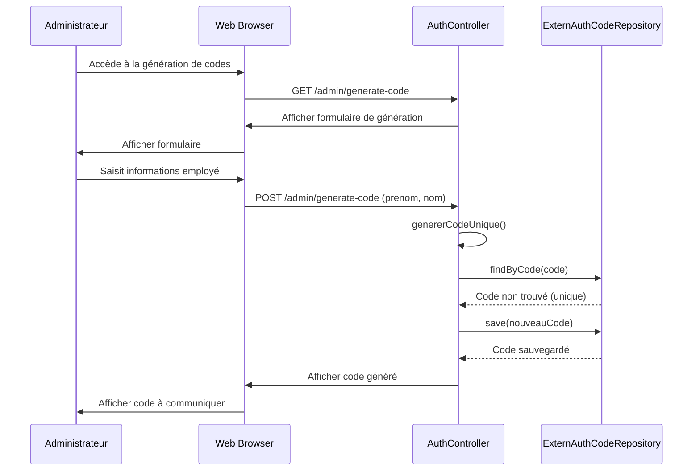
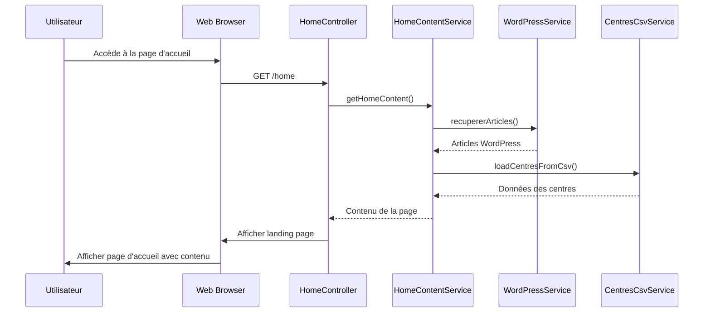
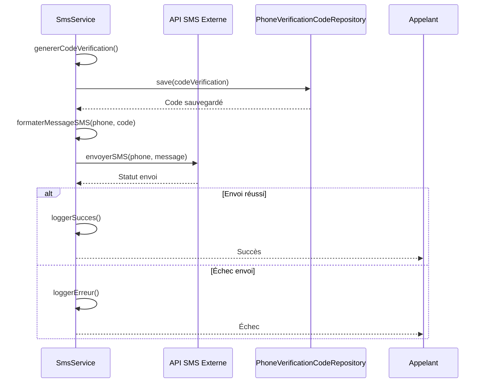

# Diagramme de Séquences - Projet COSONE

## Vue d'ensemble

Ce document présente les diagrammes de séquences du système COSONE, décrivant les interactions entre les différents composants pour les principales fonctionnalités.

## 1. Séquence d'Inscription Utilisateur



## 2. Séquence de Vérification SMS



## 3. Séquence de Création de Réservation



## 4. Séquence de Vérification de Disponibilité



## 4.1 Bilan du Processus Complet de Réservation (Cycle de Vie Complet)

Ce diagramme présente le cycle de vie complet d'une réservation, depuis la consultation des centres jusqu'à la confirmation du paiement.

```mermaid
sequenceDiagram
    autonumber
    participant U as Utilisateur
    participant W as Web Browser
    participant RC as ReservationController
    participant CR as CentreRepository
    participant TLR as TypeLogementRepository
    participant RS as ReservationService
    participant RR as ReservationRepository
    participant PAR as PersonneAccompagnementRepository
    participant PS as PrixService
    participant ES as EmailService
    participant DB as Base de Données

    rect rgb(200, 220, 250)
    Note over U,DB: PHASE 1 : Consultation des Centres et Types de Logement
    U->>W: Accède à la page de réservation
    activate W
    W->>RC: GET /reservation
    activate RC
    RC->>CR: findByActifTrueOrderByNom()
    activate CR
    CR->>DB: SELECT * FROM centres WHERE actif = true
    activate DB
    DB-->>CR: Liste des centres actifs
    deactivate DB
    CR-->>RC: Liste des centres
    deactivate CR
    RC->>TLR: findByActifTrueOrderByNom()
    activate TLR
    TLR->>DB: SELECT * FROM types_logement WHERE actif = true
    activate DB
    DB-->>TLR: Liste des types de logement actifs
    deactivate DB
    TLR-->>RC: Liste des types de logement
    deactivate TLR
    RC-->>W: Modèle avec centres et types
    deactivate RC
    W-->>U: Afficher formulaire de réservation
    deactivate W
    end

    rect rgb(220, 250, 220)
    Note over U,DB: PHASE 2 : Sélection et Vérification de Disponibilité
    U->>W: Sélectionne centre, type, dates et nombre de personnes
    activate W
    W->>RC: POST /reservation/verifier-disponibilite
    activate RC
    RC->>CR: findById(centreId)
    activate CR
    CR->>DB: SELECT * FROM centres WHERE id = ?
    activate DB
    DB-->>CR: Centre trouvé
    deactivate DB
    CR-->>RC: Centre
    deactivate CR
    RC->>TLR: findById(typeLogementId)
    activate TLR
    TLR->>DB: SELECT * FROM types_logement WHERE id = ?
    activate DB
    DB-->>TLR: Type de logement trouvé
    deactivate DB
    TLR-->>RC: Type de logement
    deactivate TLR
    
    alt Capacité insuffisante
        RC->>TLR: getCapaciteMax()
        TLR-->>RC: Capacité maximale
        RC-->>W: Erreur : Capacité dépassée
        W-->>U: Message d'erreur capacité
    else Capacité OK
        RC->>RS: estDisponible(centre, type, dateDebut, dateFin)
        activate RS
        RS->>RR: findByCentreIdAndTypeLogementIdAndStatutNot(centreId, typeId, ANNULEE)
        activate RR
        RR->>DB: SELECT * FROM reservations WHERE centre_id = ? AND type_logement_id = ? AND statut != 'ANNULEE'
        activate DB
        DB-->>RR: Réservations existantes
        deactivate DB
        RR-->>RS: Liste des réservations
        deactivate RR
        RS->>RS: verifierConflitsDates(dateDebut, dateFin, reservations)
        
        alt Conflit de dates détecté
            RS-->>RC: Non disponible
            RC-->>W: Statut : Non disponible
            W-->>U: Message : Dates non disponibles
        else Pas de conflit
            RS-->>RC: Disponible
            deactivate RS
            RC-->>W: Statut : Disponible
            deactivate RC
            W-->>U: Confirmation de disponibilité
            deactivate W
        end
    end
    end

    rect rgb(255, 240, 200)
    Note over U,DB: PHASE 3 : Calcul du Prix et Ajout des Accompagnants
    U->>W: Ajoute les personnes d'accompagnement (optionnel)
    activate W
    W->>RC: Affiche le formulaire d'accompagnants
    U->>W: Saisit les informations des accompagnants
    W->>RC: Calcule le prix total
    activate RC
    RC->>PS: calculerPrixTotal(typeLogement, dateDebut, dateFin)
    activate PS
    PS->>TLR: getPrixParNuit()
    activate TLR
    TLR-->>PS: Prix par nuit
    deactivate TLR
    PS->>PS: calculerNombreNuits(dateDebut, dateFin)
    PS->>PS: appliquerMajorationWeekend()
    PS-->>RC: Prix total calculé
    deactivate PS
    RC-->>W: Afficher prix total et récapitulatif
    deactivate RC
    W-->>U: Afficher récapitulatif et prix
    deactivate W
    end

    rect rgb(255, 220, 220)
    Note over U,DB: PHASE 4 : Création de la Réservation
    U->>W: Confirme la réservation
    activate W
    W->>RC: POST /reservation/creer (données complètes)
    activate RC
    
    RC->>RS: creerReservation(reservationDTO)
    activate RS
    RS->>RS: validerDonnees(reservationDTO)
    
    alt Validation échouée
        RS-->>RC: Erreur de validation
        RC-->>W: Message d'erreur
        W-->>U: Afficher erreur de validation
    else Validation réussie
        RS->>RS: creerEntiteReservation()
        RS->>RR: save(reservation)
        activate RR
        RR->>DB: INSERT INTO reservations VALUES (...)
        activate DB
        DB-->>RR: Réservation créée avec ID
        deactivate DB
        RR-->>RS: Réservation sauvegardée
        deactivate RR
        
        opt Si accompagnants présents
            loop Pour chaque accompagnant
                RS->>PAR: save(personneAccompagnement)
                activate PAR
                PAR->>DB: INSERT INTO personnes_accompagnement VALUES (...)
                activate DB
                DB-->>PAR: Accompagnant créé
                deactivate DB
                PAR-->>RS: Accompagnant sauvegardé
                deactivate PAR
            end
        end
        
        RS->>RS: calculerDateLimitePaiement() (J+1)
        RS->>RR: updateDateLimitePaiement(reservation)
        activate RR
        RR->>DB: UPDATE reservations SET date_limite_paiement = ?
        activate DB
        DB-->>RR: Date mise à jour
        deactivate DB
        RR-->>RS: Réservation mise à jour
        deactivate RR
        
        RS-->>RC: Réservation créée avec succès
        deactivate RS
        
        RC->>ES: envoyerEmailConfirmationReservation(reservation)
        activate ES
        ES->>ES: preparerContenuEmail(reservation)
        ES->>ES: envoyerEmail(destinataire, contenu)
        ES-->>RC: Email envoyé
        deactivate ES
        
        RC-->>W: Redirection vers /reservation/confirmation/{id}
        deactivate RC
        W-->>U: Afficher page de confirmation avec détails
        deactivate W
    end
    end

    rect rgb(230, 200, 250)
    Note over U,DB: PHASE 5 : Confirmation du Paiement
    U->>W: Accède à la confirmation de réservation
    activate W
    W->>RC: GET /reservation/confirmation/{id}
    activate RC
    RC->>RR: findById(id)
    activate RR
    RR->>DB: SELECT * FROM reservations WHERE id = ?
    activate DB
    DB-->>RR: Réservation trouvée
    deactivate DB
    RR-->>RC: Réservation avec détails
    deactivate RR
    RC-->>W: Afficher formulaire de paiement
    deactivate RC
    W-->>U: Afficher options de paiement
    deactivate W
    
    U->>W: Saisit méthode et référence de paiement
    activate W
    W->>RC: POST /reservation/paiement/{id}
    activate RC
    RC->>RS: confirmerPaiement(id, methode, reference)
    activate RS
    RS->>RR: findById(id)
    activate RR
    RR->>DB: SELECT * FROM reservations WHERE id = ?
    activate DB
    DB-->>RR: Réservation trouvée
    deactivate DB
    RR-->>RS: Réservation
    deactivate RR
    
    alt Vérification du statut
        RS->>RS: verifierStatut(reservation)
        alt Statut != EN_ATTENTE_PAIEMENT
            RS-->>RC: Erreur : Statut invalide
            RC-->>W: Message d'erreur
            W-->>U: Afficher erreur statut
        else Statut OK
            RS->>RS: verifierDateLimitePaiement(reservation)
            alt Date limite dépassée
                RS->>RR: updateStatut(reservation, EXPIREE)
                activate RR
                RR->>DB: UPDATE reservations SET statut = 'EXPIREE'
                activate DB
                DB-->>RR: Statut mis à jour
                deactivate DB
                RR-->>RS: Réservation expirée
                deactivate RR
                RS-->>RC: Erreur : Délai de paiement dépassé
                RC-->>W: Message d'erreur
                W-->>U: Afficher erreur expiration
            else Date limite OK
                RS->>RR: updatePaiement(id, methode, reference, statut)
                activate RR
                RR->>DB: UPDATE reservations SET methode_paiement = ?, reference_paiement = ?, statut = 'PAYEE'
                activate DB
                DB-->>RR: Paiement enregistré
                deactivate DB
                RR-->>RS: Réservation mise à jour
                deactivate RR
                RS-->>RC: Paiement confirmé
                deactivate RS
                
                RC->>ES: envoyerConfirmationPaiement(reservation)
                activate ES
                ES->>ES: preparerEmailPaiement(reservation)
                ES->>ES: envoyerEmail(destinataire, contenu)
                ES-->>RC: Email envoyé
                deactivate ES
                
                RC-->>W: Redirection vers confirmation succès
                deactivate RC
                W-->>U: Afficher confirmation de paiement réussie
                deactivate W
            end
        end
    end
    end

    rect rgb(200, 250, 250)
    Note over U,DB: PHASE 6 : Consultation de la Réservation (Optionnel)
    U->>W: Accède à son espace réservation
    activate W
    W->>RC: GET /espace-reservation
    activate RC
    RC->>RS: trouverReservationsUtilisateur(matricule)
    activate RS
    RS->>RR: findByMatricule(matricule)
    activate RR
    RR->>DB: SELECT * FROM reservations WHERE matricule = ?
    activate DB
    DB-->>RR: Liste des réservations de l'utilisateur
    deactivate DB
    RR-->>RS: Réservations trouvées
    deactivate RR
    RS-->>RC: Liste des réservations
    deactivate RS
    RC-->>W: Afficher réservations avec statuts
    deactivate RC
    W-->>U: Afficher tableau de bord des réservations
    deactivate W
    end

    Note over U,DB: Fin du Processus de Réservation
```

### Description des Phases du Processus Complet

#### Phase 1 : Consultation des Centres et Types de Logement
- L'utilisateur accède à la page de réservation
- Le système récupère les centres actifs et les types de logement disponibles
- Affichage du formulaire de réservation avec toutes les options

#### Phase 2 : Sélection et Vérification de Disponibilité
- L'utilisateur choisit le centre, le type de logement, les dates et le nombre de personnes
- Le système vérifie la capacité du logement
- Le système vérifie la disponibilité en consultant les réservations existantes
- Détection des conflits de dates potentiels

#### Phase 3 : Calcul du Prix et Ajout des Accompagnants
- L'utilisateur peut ajouter des personnes d'accompagnement
- Le système calcule le prix total en fonction :
  - Du prix par nuit du type de logement
  - Du nombre de nuits
  - Des éventuelles majorations (weekend, etc.)
- Affichage du récapitulatif complet avec le prix

#### Phase 4 : Création de la Réservation
- Validation de toutes les données saisies
- Création de l'enregistrement de réservation en base
- Enregistrement des accompagnants si présents
- Calcul de la date limite de paiement (24h)
- Envoi d'un email de confirmation
- Affichage de la page de confirmation

#### Phase 5 : Confirmation du Paiement
- L'utilisateur accède à sa réservation
- Vérification du statut (doit être EN_ATTENTE_PAIEMENT)
- Vérification de la date limite de paiement
- Saisie de la méthode et référence de paiement
- Mise à jour du statut à PAYEE
- Envoi d'un email de confirmation de paiement

#### Phase 6 : Consultation de la Réservation
- L'utilisateur peut consulter toutes ses réservations
- Affichage des statuts et détails
- Possibilité d'annulation selon les conditions

### Points Clés du Cycle de Vie

**Statuts d'une Réservation :**
1. **EN_ATTENTE_PAIEMENT** : Réservation créée, en attente de paiement (max 24h)
2. **PAYEE** : Paiement confirmé, réservation validée
3. **EXPIREE** : Délai de paiement dépassé
4. **ANNULEE** : Réservation annulée par l'utilisateur

**Validations Critiques :**
- Vérification de la capacité du logement
- Détection des conflits de dates
- Validation du statut avant paiement
- Contrôle de la date limite de paiement

**Communications :**
- Email de confirmation après création de la réservation
- Email de confirmation après paiement
- Email de confirmation en cas d'annulation

**Traçabilité :**
- Toutes les opérations sont enregistrées en base de données
- Historique complet des modifications de statut
- Logs des envois d'emails et des transactions

## 5. Séquence de Confirmation de Paiement



## 6. Séquence d'Annulation de Réservation



## 7. Séquence de Connexion Utilisateur



## 8. Séquence de Génération de Code d'Authentification (Admin)



## 9. Séquence de Chargement de la Page d'Accueil



## 10. Séquence d'Envoi de SMS



## Points Clés des Interactions

### Gestion des Erreurs
- Chaque interaction inclut des vérifications de validité
- Les erreurs sont propagées avec des messages explicites
- Les rollbacks sont effectués en cas d'échec

### Sécurité
- Authentification requise pour les opérations sensibles
- Validation des données à chaque étape
- Gestion des sessions utilisateur

### Performance
- Utilisation de repositories pour l'accès aux données
- Mise en cache des données fréquemment utilisées
- Optimisation des requêtes de base de données

### Traçabilité
- Logging des opérations importantes
- Suivi des modifications d'état
- Historique des actions utilisateur
